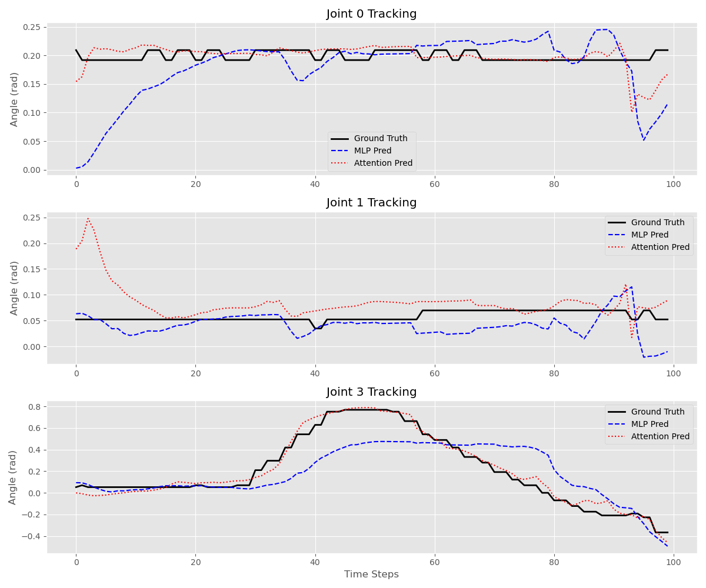
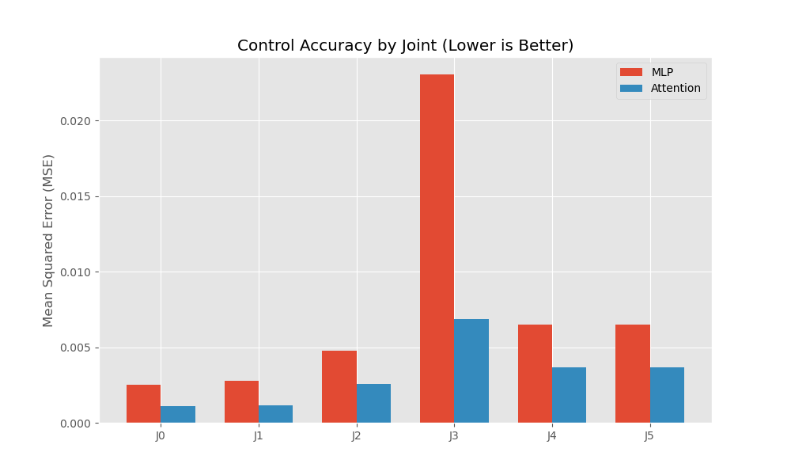
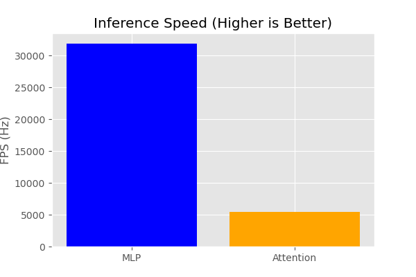

# Visual-Visuomotor Action (VVA) - Project Documentation

This repository implements a robotic arm control system that learns to imitate motions from video demonstrations. It uses a YOLO-based vision pipeline to detect robot joints and an Attention-based Policy to predict joint angles.

---

## 1. Data Collection (`collectdata.py`)

The data collection pipeline allows a human operator to control the simulated robot arm using a physical master arm (or slider interface) connected via Serial.

### How it works:
1.  **Serial Interface**: Reads Y/P/R/End-Effector values from a microcontroller (e.g., ESP32 connected to `/dev/ttyUSB0` at 115200 baud).
2.  **Simulation Loop**: Maps these inputs to the PyBullet robot's joint positions in real-time.
3.  **Recording**:
    *   **Video**: Captures a high-resolution ($640 \times 640$) camera view of the robot performing the task.
    *   **Telemetry**: Logs precise joint angles ($J_0$ to $J_5$) and gripper states to a CSV file synchronized with the video frames.

### Data Organization (`data/` folder):
*   **`data/camview/`**: Contains the recorded `.mp4` video files (the "visual" input).
*   **`data/jointdata/`**: Contains the matching `.csv` files (the "action" labels).
*   **`data/demovideos/`**: A curated subset of videos used for validating the trained policy.

---

## 2. Vision Pipeline: YOLO Object Detection

Instead of using raw pixels directly, we use **YOLOv8** to extract a low-dimensional state representation of the robot.

1.  **Detection**: We trained a YOLOv8 model (`yolodetect/models/run/weights/best.pt`) to detect 7 specific classes:
    *   **0-5**: Robot Joints ($J_0, J_1, ..., J_5$)
    *   **6**: Target Object (Cube)
2.  **Centroid Extraction**: For each frame, we detect the bounding boxes of these classes. We calculate the **centroid $(x, y)$** of each box.
3.  **State Vector**: These centroids are normalized to $[0, 1]$ and flattened into a **14-dimensional state vector**:
    ```
    State = [J0x, J0y, J1x, J1y, ..., Target_x, Target_y]
    ```
    This vector serves as the input to our control policy.

---

## 3. Policy Architecture: Attention Model

We utilize an **Attention-Based Policy** (`RobotPolicyAttention`) rather than a simple MLP. This allows the network to learn relationships between different parts of the robot and the target object dynamically.

### Architecture Details:
1.  **Input Embedding**: The 14-dim input is reshaped into a sequence of 7 objects (6 joints + 1 target), each with 2 coordinates $(x,y)$. A linear layer embeds these coordinates into a 32-dimensional vector.
2.  **Self-Attention**: A `MultiheadAttention` layer (4 heads) processes this sequence. It allows the model to "attend" to how the target's position relates specifically to the end-effector or other joints, regardless of absolute position.
3.  **Decision Head**: The attention output is flattened and passed through a Multi-Layer Perceptron (MLP) [128 -> 64 -> 6] to predict the **target joint angles ($6$ DOF)** for the next control step.

### Training
The Attention Policy was trained using:
```bash
python3 training_scripts/train_policy2_attention.py
```
This script loads the smoothed YOLO detections (`yolodetect/data/policy_dataset_smoothed.npz`) and trains the model to predict the next joint configuration.

---

## 4. Setup & Running from Scratch

> **Note**: This project has been tested and verified on **Ubuntu 22.04**. Compatibility with other OS versions is not guaranteed.

If you are a new user, follow these steps to clone and run the project:

### 1. Clone & Install
```bash
# 1. Clone the repository
git clone https://github.com/AradhyaSpace11/realvva.git
cd realvva

# 2. Install Dependencies
pip install -r requirements.txt
```

### 2. Available Inference Modes
We provide interactive scripts to visualize detection and run the full policy check.

#### A. Visualize Vision Pipeline
See what the robot "sees". This script runs the YOLO detector on a video and overlays the detecting skeleton (centroids connected by lines).
```bash
python3 yolodetect/infer_scripts/infer_video.py
```

#### B. Run Policy (Simulation vs Demo)
Watch the trained robot (in simulation) try to imitate the motions of the real demo video side-by-side.
```bash
python3 infer_scripts/run_vva_attention.py
```
*Note: Both scripts will open a menu to let you select which demo video to use.*

---

## 5. Results & Analysis

All analytical results and graphs are stored in the `results/` folder. Key metrics include:

### Trajectory Comparison
We compare the predicted joint paths against the ground truth.


### Control Accuracy (MSE)
We benchmarked the Mean Squared Error (MSE) for each joint.

*Lower is better. Notice how the Attention model (Orange) consistently outperforms the baseline MLP (Blue).*

### Inference Latency
Real-time performance is critical.

*The Attention model maintains high FPS suitable for real-time control.*

---

## 6. Future Improvements

1.  **Generalized Object Detection**: Currently, the system is trained explicitly on a red cube. To handle diverse objects (balls, cups, tools), we need to expand the YOLO training dataset.
2.  **Zero-Shot Detection with VLM**: A powerful upgrade would be integrating a **Vision-Language Model (VLM)** or using prompts from an Image-to-Video (I2V) generator.
    *   *Idea*: Use the text prompt (e.g., "pick up the blue ball") to identify the target object using a zero-shot detector (like Grounding DINO) instead of a fixed YOLO class. This would allow the robot to interact with novel objects without retraining the vision pipeline.
